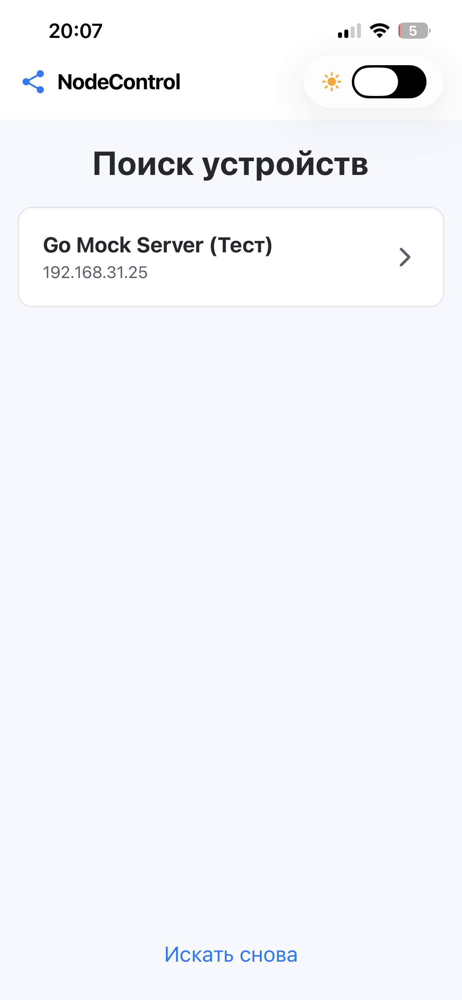

# NodeControl

NodeControl — это мобильное приложение на React Native (Expo), предназначенное для управления IoT-устройствами (такими как ESP8266, ESP32, Arduino с Ethernet-модулем) в локальной сети. Приложение автоматически обнаруживает совместимые устройства и предоставляет пользовательский интерфейс для управления их функциями.

## 🚀 Особенности

- **Автоматическое обнаружение**: Сканирует локальную сеть для поиска совместимых устройств.
- **Динамический интерфейс**: Элементы управления генерируются на основе данных, полученных от устройства.
- **Поддержка тем**: Светлая и темная темы для комфортного использования.
- **Оптимистичное обновление UI**: Интерфейс реагирует мгновенно, обеспечивая плавный пользовательский опыт.
- **Расширяемость**: Легко добавлять поддержку новых типов элементов управления (например, слайдеры, кнопки).

## 🎬 Демонстрация




## 🛠️ Начало работы

### Требования

- [Node.js](https://nodejs.org/)
- [npm](https://www.npmjs.com/)
- [Expo Go](https://expo.dev/go) на вашем мобильном устройстве (для тестирования)

### Установка и запуск

1.  **Клонируйте репозиторий:**

    ```bash
    git clone https://github.com/ваш-логин/NodeControl.git
    cd NodeControl
    ```

2.  **Установите зависимости:**

    ```bash
    npm install
    ```

3.  **Запустите проект:**

    ```bash
    npx expo start
    ```

4.  Отсканируйте QR-код с помощью приложения Expo Go на вашем телефоне. Убедитесь, что ваш телефон и компьютер находятся в одной Wi-Fi сети.

## 🧪 Разработка с мок-сервером

Для удобства разработки и тестирования UI без реального устройства в проекте есть мок-сервер, написанный на Go. Он имитирует поведение настоящего IoT-устройства.

### Запуск мок-сервера

1.  **Перейдите в директорию сервера:**

    ```bash
    cd mock-server
    ```

2.  **Запустите сервер:**

    ```bash
    go run main.go
    ```

    Сервер запустится на порту `80`. Приложение NodeControl автоматически обнаружит его при сканировании сети.

    > **Примечание:** Для запуска на порту 80 могут потребоваться права администратора. Если возникнет ошибка "permission denied", используйте `sudo go run main.go`.

## 📜 Контракт API (для устройств)

Чтобы ваше устройство было совместимо с приложением NodeControl, оно должно реализовывать следующий HTTP API.

### 1. Обнаружение

Приложение отправляет GET-запрос на все IP-адреса в локальной сети.

- **Эндпоинт:** `GET /discovery`
- **Описание:** Устройство должно ответить на этот запрос, чтобы быть обнаруженным.
- **Ответ (`200 OK`):**

  ```json
  {
    "type": "NodeControlDevice",
    "name": "Имя вашего устройства"
  }
  ```

  - `type` (string, **обязательно**): Должно быть `"NodeControlDevice"`.
  - `name` (string, **обязательно**): Пользовательское имя устройства, которое будет отображаться в списке.

### 2. Получение возможностей

После обнаружения приложение запрашивает список доступных элементов управления.

- **Эндпоинт:** `GET /capabilities`
- **Описание:** Возвращает массив объектов, описывающих каждый элемент управления.
- **Ответ (`200 OK`):**
  ```json
  [
    {
      "id": "main_light",
      "type": "toggle",
      "label": "Основной свет",
      "endpoint": "/controls/main_light",
      "value": true
    },
    {
      "id": "led_brightness",
      "type": "slider",
      "label": "Яркость ленты",
      "endpoint": "/controls/led_brightness",
      "value": 80,
      "min": 0,
      "max": 100
    }
  ]
  ```

#### Структура объекта `Capability`:

- `id` (string): Уникальный идентификатор элемента.
- `type` (string): Тип элемента управления. На данный момент поддерживается:
  - `"toggle"`: Переключатель (вкл/выкл).
- `label` (string): Название элемента, которое увидит пользователь.
- `endpoint` (string): Уникальный путь для управления этим элементом (относительно IP-адреса устройства).
- `value` (any): Текущее значение элемента (например, `true`/`false` для `toggle`).
- `min` (number, _опционально_): Минимальное значение (для слайдеров).
- `max` (number, _опционально_): Максимальное значение (для слайдеров).

### 3. Управление

Приложение отправляет POST-запрос для изменения состояния элемента управления.

- **Эндпоинт:** `POST {endpoint}` (например, `/controls/main_light`)
- **Описание:** Изменяет состояние элемента управления.
- **Тело запроса:**

  ```json
  {
    "value": false
  }
  ```

  - `value` (any): Новое значение, которое нужно установить.

- **Ответ:**
  - `200 OK`: Если команда выполнена успешно.
  - `400 Bad Request`: Если тело запроса некорректно.
  - `500 Internal Server Error`: Если произошла ошибка на устройстве.
